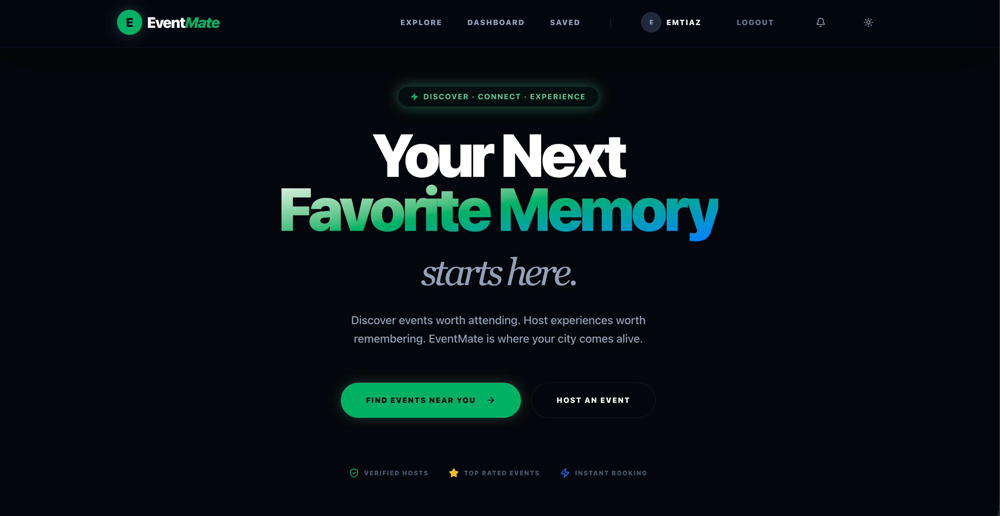

# EventMate — Client

<p align="center">
  
</p>

<p align="center">
  <strong>Discover and host unforgettable local events.</strong><br/>
  Connect with people who share your passions through EventMate.
</p>

<p align="center">
  <a href="https://eventmate-client-1.onrender.com/">🌐 Live App</a> &nbsp;|&nbsp;
  <a href="https://eventmate-server-5.onrender.com/">⚙️ Backend API</a>
</p>

---

## Tech Stack

| Layer | Technology |
|---|---|
| Framework | Next.js 16 (App Router) |
| Language | TypeScript |
| Styling | Tailwind CSS v4 |
| UI Components | Shadcn UI + Radix UI |
| State Management | Zustand |
| Server State | TanStack React Query v5 |
| HTTP Client | Axios |
| Forms | React Hook Form + Zod |
| Payments | Stripe (React Stripe.js) |
| Real-time | Socket.io Client |
| Notifications | Sonner (toast) |
| Icons | Lucide React |
| Fonts | Outfit (Google Fonts) |

---

## Features

### Auth
- JWT login with access + refresh tokens
- Email verification on register
- Forgot / reset password flow
- Persistent auth state via Zustand

### Events
- Browse with search, category, location, date range, paid-only filters
- Create events with image upload via ImageKit (HOST)
- Edit, cancel, delete own events (HOST)
- Duplicate event (HOST)
- Join free or paid events (Stripe payment flow)
- Approval-required events — pending / approved / rejected status
- Save / bookmark events
- Event analytics dashboard (HOST)

### Participants (HOST)
- View all participants per event
- Approve or reject pending join requests
- Check-in / undo check-in participants
- Waitlist management

### Payments
- Stripe Elements integration
- Payment intent created server-side
- Confirmed server-side after Stripe success

### Reviews
- Approved participants can rate and review the host
- Shows reviewer name, host name, and event name
- Star ratings with average score on host profile
- All reviews page with load more pagination

### Notifications
- Real-time via Socket.io
- Bell icon with unread count badge
- Notification dropdown in navbar

### Admin Dashboard
- Real analytics (users, hosts, events, revenue)
- Manage users — ban, role change, delete
- Host verification workflow
- Event moderation (event-shield)
- System logs

---

## Getting Started

### 1. Clone & Install

```bash
git clone <repo-url>
cd eventmate_client
npm install
```

### 2. Environment Variables

Create `.env.local`:

```env
NEXT_PUBLIC_API_URL=http://localhost:5001/api/v1
NEXT_PUBLIC_STRIPE_PUBLISHABLE_KEY=pk_test_...
```

### 3. Run

```bash
npm run dev       # Development (Turbopack)
npm run build     # Production build
npm start         # Start production server
```

App runs on `http://localhost:3000`

---

## Project Structure

```text
src/
├── app/
│   ├── page.tsx                    # Home — events, hosts, reviews, CTA
│   ├── layout.tsx                  # Root layout + metadata + favicon
│   ├── login/
│   ├── register/
│   ├── forgot-password/
│   ├── reset-password/
│   ├── verify-email/
│   ├── verify-email-sent/
│   ├── dashboard/                  # Role-based dashboard
│   ├── reviews/                    # All reviews page
│   ├── events/
│   │   ├── page.tsx                # Browse events + filters
│   │   ├── create/                 # Create event (HOST)
│   │   └── [id]/
│   │       ├── page.tsx            # Event detail + join/pay/review
│   │       ├── edit/               # Edit event (HOST)
│   │       └── analytics/          # Event analytics (HOST)
│   ├── profile/[id]/               # User profile + reviews
│   ├── saved/                      # Bookmarked events
│   ├── hosts/                      # Browse all verified hosts
│   └── admin/
│       ├── page.tsx                # Admin dashboard
│       ├── users/                  # User management
│       ├── hosts/                  # Host management
│       ├── events/                 # Event moderation
│       ├── host-verifications/     # Host approval workflow
│       ├── event-shield/           # Event moderation shield
│       └── system-logs/            # System logs
├── components/
│   ├── Navbar.tsx
│   ├── PaymentForm.tsx
│   └── providers/
├── services/                       # API layer (Axios)
│   ├── auth.service.ts
│   ├── event.service.ts
│   ├── user.service.ts
│   ├── review.service.ts
│   ├── payment.service.ts
│   ├── admin.service.ts
│   └── analytics.service.ts
├── store/
│   └── auth.store.ts               # Zustand auth
├── hooks/
│   └── useNotifications.ts         # Socket.io notifications
└── lib/
    ├── api.ts                      # Axios instance + interceptors
    └── socket.ts                   # Socket.io singleton
```

---

## Pages

| Route | Access | Description |
|---|---|---|
| `/` | Public | Home — featured events, hosts, reviews |
| `/events` | Public | Browse + filter events |
| `/events/:id` | Public | Event detail, join, pay, review |
| `/events/create` | HOST | Create new event |
| `/events/:id/edit` | HOST | Edit event |
| `/events/:id/analytics` | HOST | Event analytics |
| `/hosts` | Public | All verified hosts |
| `/reviews` | Public | All community reviews |
| `/login` | Public | Login |
| `/register` | Public | Register as USER or HOST |
| `/forgot-password` | Public | Password recovery |
| `/reset-password` | Public | Reset with token |
| `/verify-email` | Public | Email verification |
| `/verify-email-sent` | Public | Verification sent confirmation |
| `/dashboard` | Auth | Role-based dashboard |
| `/profile/:id` | Auth | User profile + edit |
| `/saved` | Auth | Saved/bookmarked events |
| `/admin` | ADMIN | Admin overview |
| `/admin/users` | ADMIN | User management |
| `/admin/hosts` | ADMIN | Host management |
| `/admin/events` | ADMIN | Event moderation |
| `/admin/host-verifications` | ADMIN | Host approval workflow |
| `/admin/event-shield` | ADMIN | Event shield / moderation |
| `/admin/system-logs` | ADMIN | System logs |

---

## Environment Variables

| Variable | Description |
|---|---|
| `NEXT_PUBLIC_API_URL` | Backend API base URL |
| `NEXT_PUBLIC_STRIPE_PUBLISHABLE_KEY` | Stripe publishable key |

---

## Deployment

Deployed on **Render** as a Node.js Web Service.

- Build: `npm install && npm run build`
- Start: `npm start`

---

## Related

- [EventMate Server](../eventmate_server/README.md) — Backend REST API

---

## License

MIT
